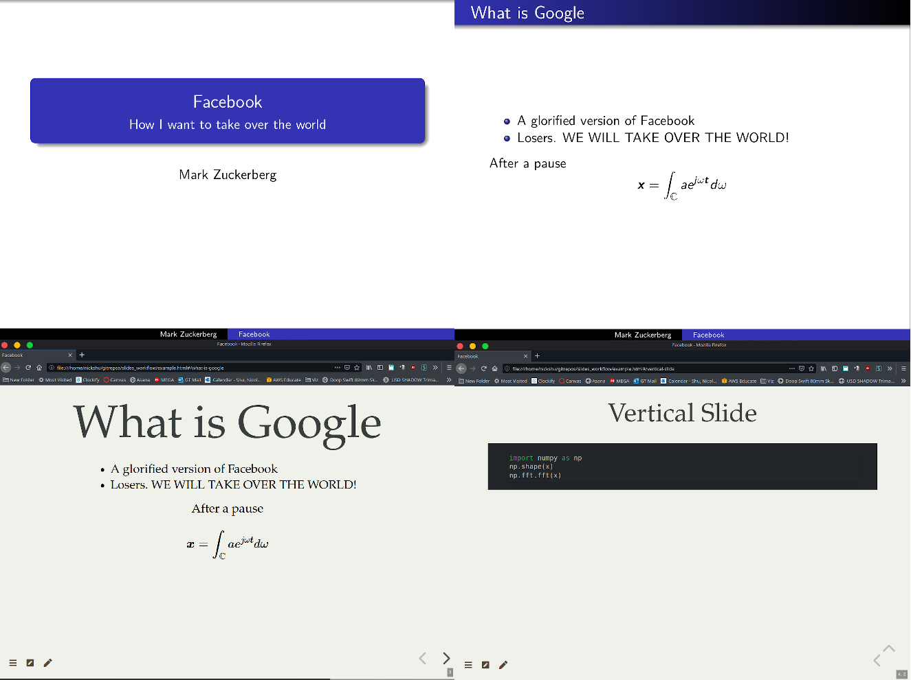

# Presentations from Markdown Files



## Descriptions 
This is a very quick way of making slides from Markdown files and then to compile them to RevealJS and/or 


## Quick Start 
### Requirements
Install pandoc. There are many ways to do so. You may use [package managers](https://pandoc.org/installing.html), [pip package](https://pypi.org/project/pypandoc/) installation, [conda package](https://anaconda.org/conda-forge/pandoc), and others. Note that if you install via `conda` for example, you will have to have that respective virtual environment activated in order to run some of the compilation scripts, even if the `pandoc` command is accessible at a base environment (I learned that from experience \*face palm\*). 


### Start
1. First prepare a new presentation folder. Choose a name and pass it as the first argument. This will prepare a folder and will rename the example script `example.md` as `slides.md` for you to start with. 
    ```
    $ bash prep_proj.sh name_of_presentation
    ```
1. Next go to the presentation folder and start editing your `slides.md` file.
1. Compile your project to see how it looks. You may choose a different name for your slides. Just make sure to pass the correct filename instead of your `slides.md` and it will compile. By default, it will make a new HTML file with the same name as your Markdown file
    - RevealJS
        ```
        $ bash compile_revealjs.sh slides.md
        ```
    - Beamer
        ```
        $ bash compile_beamer.sh slides.md
        ```
1. Next, to view your project, simply open the file on a browser. You may also create a local server and open on your server. In the example below, you'd have to go to http://0.0.0.0:8000/ on your browser, but you can also change the selected port. _Serving is a good option if you plan on implementing some applications into your slideshow that may require access to some source files._
    ```
    $ python3 -m http.server
    Serving HTTP on 0.0.0.0 port 8000 (http://0.0.0.0:8000/) ...
    ```
1. Rinse and repeat until you have a good presentation! 

### Notes:  
At the time of making this workflow (2020-June-05), pandoc had some issues with properly working with the latest Github repositories from Hakim El Hattab's [RevealJS](https://github.com/hakimel/reveal.js/). That is why I included its own RevealJS folder (~9MB). In such case, I manipulated the original default template that pandoc used to create the slides in order to properly function, and to have some of the plugins that I wanted. This can be found in the `custom_styles` folder, which is also copied to your presentation folder. Feel free to change the styles, but also make sure to modify the `compile*.sh` script properly. 

Also, this includes the CSS file and compilation file that [Dr. Matthieu Bloch](https://bloch.ece.gatech.edu/about.html) used to make his lecture slides, who was monumental to help me understand how to make this workflow. He has an even better [guide](https://bloch.ece.gatech.edu/2020/02/15/workflow.html) on his website. You should check it out! He posted that post a few days later after I had a solid workflow going, so he has even better ideas and more experience on this! He's also a really great professor, so check him out! 

# Styles and Styles
## Official Manual 
The most detailed manual can be found [here](https://pandoc.org/MANUAL.html). It's a lot to read, but most of your questions you have can be answered there. 

## Types of Code Syntax Highlighting

In order to see what types of syntax highlights pandoc provides, run 

```
pandoc --list-highlight-styles
```

Garrick Aden-Buie provides a very nice demonstration of the highlights in his [website](https://www.garrickadenbuie.com/blog/pandoc-syntax-highlighting-examples/)

# RevealJS Remarks

## Adding Columns

In order to add columns, you can use the following syntax

```markdown
::: columns
:::: column
This
::::
:::: column
That
::::
```


## Adding a floating text 

The easiest way I've found to add a floating text is by using a `div` object, and setting its style position to `absolute`. E.g. 

```markdown
...

# Slide 3

<div style="position: absolute; top: 250%; left: 90%; font-size: large;">
    Reference: Eebo Journal
</div>

# Slide 4
...
```
## Adding a Webpage as a Slide

You may use `iframe`, but I found that the best way is to use 

```
...
# Slide 3
 
# 
<section data-background-iframe="https://www.falstad.com/ripple/"></section>

# Slide 5
...

```

## Adding a Class to an Object

You can add a class to an object by using 

```markdown
:::{.class_name}
[object]
:::
```

I just added the CSS class `scrollable` to `reveal.js/css/reveal.css`
```css
.scrollable {
    overflow-y: auto  !important;
    overflow-x: hidden !important;
    height: 100%;
}
```

This allows any larger image to be added and makes that slide scrollable. Therefore, you can create a slide as such:

```markdown
:::{.scrollable}

# Slide Title

Very long text

:::
```


## Additional Plugins for RevealJS

There are soooo many plugins to use if you wish to use RevealJS! You can find many of them in the link below. 

https://github.com/hakimel/reveal.js/wiki/Plugins,-Tools-and-Hardware

These however might not be properly implemented in `pandoc`, and if so, you will just have to code it in HTML, and pandoc will not touch it when converting it to RevealJS HTML. 

## Variables

Variables can be passed with the flag `-V`. For example:
```
$ pandoc ... \
    -V transition=linear
```

However each different output has a different set of variables. A full description of them can be found [here](https://pandoc.org/MANUAL.html#variables). Below are a few of them

- RevealJS Variables
    - revealjs-url
    - slide-level
    - incremental
    - theme
    - center
    - controls
    - progress
    - slideNumber
    - transition
- Beamer Variables
    - aspectratio
    - beamerarticle
    - beameroption
    - institute
    - logo
    - navigation
    - section-titles
    - theme
    - colortheme
    - fonttheme
    - innertheme
    - outertheme
    - themeoptions
    - titlegraphic
